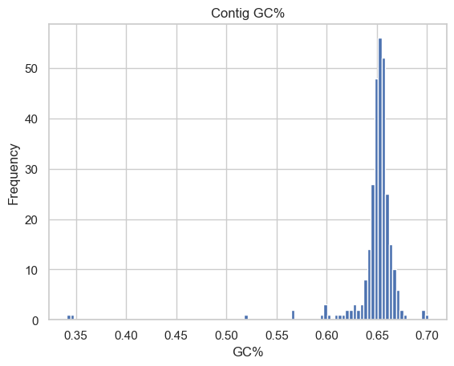
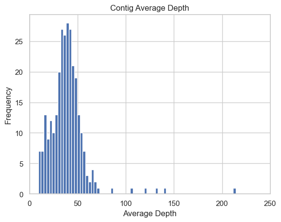
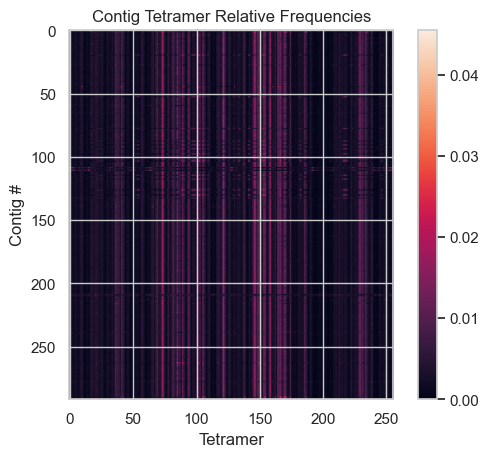
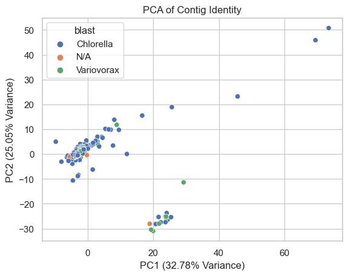

# Micractinium Analysis
# Part 1 - Libraries for the Contig Analysis


```python
from Bio import SeqIO
from Bio.Blast import NCBIWWW
from collections import Counter
import seaborn as sb
import matplotlib.pyplot as plt
import pandas as pd
from sklearn.decomposition import PCA
from sklearn.preprocessing import StandardScaler
from sklearn.cluster import KMeans
```

# Part 2 - Basic Genome Assembly Stats

## Genome Length


```python
# genome length
with open("../assembly_version2/assembly.fasta") as handle:
    print("file loaded")
    length = 0 
    for record in SeqIO.parse(handle, "fasta"):
        length += len(record.seq)
    print(length)

```

    file loaded
    51390606
    

## GC% per contig


```python
ids = []
gc_frequency = []

#focusing on the new version of the genome assembly
with open("../assembly_version2/assembly.fasta") as handle:
    print("file loaded")
    for record in SeqIO.parse(handle, "fasta"):
       id = record.id
       ids.append(record.id)
       counter = Counter(record.seq.lower())
       gc = (counter['g'] + counter['c'])/len(record.seq)
       gc_frequency.append(gc)
       print("{},{}".format(id,gc))
```

    file loaded
    contig_1,0.6513192253859491
    contig_10,0.5665818490245971
    contig_100,0.6635542168674698
    contig_101,0.6467631147243375
    contig_102,0.660989598410956
    contig_103,0.6567457307775214
    contig_104,0.6425522622143693
    contig_105,0.6128437697046127
    contig_106,0.640112220264892
    contig_107,0.664010761589404
    contig_108,0.6372554468652735
    contig_109,0.637852526439483
    contig_11,0.6605609015051354
    contig_110,0.6480224714493675
    contig_111,0.6662083757252454
    contig_112,0.6515962314939435
    contig_113,0.6504959326387898
    contig_114,0.6567395802542122
    contig_115,0.6502905074098586
    contig_116,0.6515014445384772
    contig_117,0.6574427849176026
    contig_118,0.6659181056174547
    contig_119,0.636897500638316
    contig_12,0.6518094548723502
    contig_120,0.6505064585313856
    contig_121,0.6498316498316499
    contig_122,0.658721961812452
    contig_123,0.6467424046819864
    contig_124,0.5981481481481481
    contig_125,0.6664803756443628
    contig_126,0.6519555322527945
    contig_127,0.6580670990471615
    contig_128,0.6600606839242271
    contig_129,0.6523476628813041
    contig_13,0.6674683317399618
    contig_130,0.6637711295948484
    contig_131,0.6412577417818008
    contig_132,0.6485995406081799
    contig_133,0.6493375637782447
    contig_134,0.6555179068306256
    contig_135,0.6547388237938689
    contig_136,0.6561287926971394
    contig_137,0.6494223443452195
    contig_138,0.6528630774940439
    contig_139,0.6260969612200239
    contig_14,0.6947229985204669
    contig_140,0.6562174546969382
    contig_141,0.6550753309998478
    contig_142,0.6485765748437728
    contig_143,0.6629011434894873
    contig_144,0.663957345971564
    contig_145,0.6532291979573446
    contig_146,0.6650141160104199
    contig_147,0.6461818722581605
    contig_148,0.652328331396834
    contig_149,0.6575970510309872
    contig_150,0.6564582516660133
    contig_151,0.6413520857186801
    contig_152,0.6580605358111014
    contig_153,0.642833855799373
    contig_154,0.599134987480082
    contig_155,0.6597736625514403
    contig_156,0.6636990841166546
    contig_157,0.6540387793462766
    contig_158,0.6503515148663538
    contig_159,0.653675733990907
    contig_16,0.6193413590687494
    contig_160,0.652690616198053
    contig_161,0.6764279501304726
    contig_162,0.6621401871132605
    contig_163,0.6422835965763699
    contig_165,0.6474136749123529
    contig_166,0.648235621005835
    contig_168,0.6532354261742492
    contig_169,0.6702456173689961
    contig_17,0.6514420155227197
    contig_170,0.6413725138864003
    contig_171,0.6479958509298362
    contig_172,0.6419896700944582
    contig_173,0.6387077853227153
    contig_174,0.6474798191350661
    contig_175,0.6564637223015897
    contig_176,0.6687950268655278
    contig_177,0.6554333156108134
    contig_178,0.6455202859333007
    contig_179,0.6585856855270484
    contig_18,0.6357840958323722
    contig_180,0.6553790031218212
    contig_181,0.6494895648235253
    contig_182,0.6462545648882159
    contig_183,0.6486659611207041
    contig_184,0.65879731056886
    contig_185,0.6460927577699596
    contig_186,0.6264625850340136
    contig_187,0.6536106780241092
    contig_188,0.6530874426311919
    contig_189,0.6600639406201793
    contig_19,0.6577721853961006
    contig_190,0.6706208295937878
    contig_191,0.6527153909712311
    contig_192,0.6572366645677791
    contig_193,0.6608047192386889
    contig_194,0.6503556677374943
    contig_195,0.6706370213516852
    contig_196,0.6458849827270879
    contig_197,0.667605591143822
    contig_198,0.6451263182101908
    contig_199,0.6562544020284548
    contig_2,0.6650215249383072
    contig_20,0.3465267510173106
    contig_200,0.6726390114739629
    contig_201,0.340932035334415
    contig_204,0.6693998168650629
    contig_205,0.6484927916120576
    contig_206,0.6560960710170816
    contig_207,0.6532301845819761
    contig_209,0.6433243820147353
    contig_21,0.6445430311521024
    contig_210,0.639557646735584
    contig_211,0.6442975603893762
    contig_212,0.6408836886672687
    contig_213,0.6573232789748585
    contig_214,0.6579367912820251
    contig_217,0.6596879954813534
    contig_219,0.6467968663977848
    contig_22,0.6659439010887618
    contig_220,0.6565271776211054
    contig_221,0.6456331772316902
    contig_223,0.6714189971364163
    contig_224,0.6488453949743874
    contig_225,0.6666552796091962
    contig_226,0.6504919040787046
    contig_227,0.6543774823001208
    contig_228,0.5978892150128021
    contig_23,0.6463763382200154
    contig_231,0.6457125403238771
    contig_232,0.659121082543525
    contig_233,0.6547043252433703
    contig_234,0.6251410844383594
    contig_235,0.645218945487042
    contig_236,0.6349519349272862
    contig_237,0.6563965776416469
    contig_238,0.6553111680292609
    contig_239,0.6567742161070658
    contig_24,0.6390312275304676
    contig_240,0.6558174895838322
    contig_241,0.6546345697880858
    contig_242,0.6525153374233129
    contig_243,0.6638391310257427
    contig_244,0.6598524784973537
    contig_245,0.6455167557484933
    contig_246,0.6533517074736186
    contig_247,0.6488161838316654
    contig_248,0.6508921508746283
    contig_249,0.6502297418585647
    contig_25,0.653206069505629
    contig_250,0.6536565806716608
    contig_251,0.6474457551376549
    contig_252,0.6540141713023988
    contig_253,0.6604658172442149
    contig_254,0.6525958195116103
    contig_255,0.6549390425215581
    contig_256,0.6505156901470266
    contig_257,0.6029180958916854
    contig_258,0.6478258954138949
    contig_259,0.6567401960784314
    contig_26,0.648724893858309
    contig_260,0.627972643904461
    contig_262,0.6513052492696259
    contig_263,0.6596554066571976
    contig_264,0.6518096359468734
    contig_265,0.6176730639205285
    contig_266,0.6603062289757569
    contig_267,0.6447381206879798
    contig_268,0.6574446592975266
    contig_269,0.6548388984811683
    contig_27,0.6500592819286387
    contig_270,0.6511916298313994
    contig_271,0.654238934765837
    contig_272,0.6544953382897178
    contig_273,0.645143682118935
    contig_274,0.6585994577339691
    contig_275,0.6413135713073486
    contig_276,0.6489883874057225
    contig_277,0.6515916356361202
    contig_278,0.6499035214664737
    contig_279,0.6511804923135475
    contig_28,0.6502795653549952
    contig_280,0.6473917699250421
    contig_281,0.658290291041607
    contig_282,0.6545755803548232
    contig_283,0.667433514309377
    contig_284,0.6487251936309544
    contig_285,0.6542727628854441
    contig_286,0.6549221101772714
    contig_287,0.6573424874912965
    contig_288,0.6532498785200268
    contig_289,0.6443115097104829
    contig_29,0.6409342146936524
    contig_290,0.6547748798796494
    contig_292,0.6527124769721885
    contig_293,0.655549021704266
    contig_294,0.6536421390242398
    contig_295,0.6516098190810415
    contig_296,0.6469072980550756
    contig_297,0.6509296712880815
    contig_299,0.6647866150134302
    contig_3,0.6550907363772067
    contig_30,0.6542697701740215
    contig_300,0.5183776932826363
    contig_302,0.5649518608995545
    contig_303,0.6572418403938491
    contig_304,0.6606153594627395
    contig_305,0.6312809624911536
    contig_306,0.6105172691625933
    contig_307,0.6576532969571627
    contig_308,0.6421387520525451
    contig_309,0.6556641515402436
    contig_31,0.6480831284026781
    contig_310,0.6652493016838749
    contig_311,0.6472140411726891
    contig_312,0.6529089199752232
    contig_313,0.651753728234608
    contig_32,0.6664123250934144
    contig_33,0.6562617137207395
    contig_34,0.6187664173021801
    contig_35,0.6393389055137069
    contig_36,0.6330409510395426
    contig_37,0.6433046378509938
    contig_38,0.6592935862852275
    contig_39,0.6522611733925052
    contig_4,0.6460644114365797
    contig_40,0.6532003781294788
    contig_41,0.6434635576786644
    contig_42,0.6559715180798511
    contig_43,0.6543564381104245
    contig_44,0.6545343635624238
    contig_45,0.6466900302664815
    contig_46,0.6552433764965759
    contig_47,0.6232956758862486
    contig_48,0.6486042132450407
    contig_49,0.630373291651135
    contig_5,0.6588036874661078
    contig_50,0.646094816055771
    contig_51,0.6582743158461953
    contig_52,0.6505185429061919
    contig_53,0.6576413232929078
    contig_54,0.6525002313450645
    contig_55,0.649557909513908
    contig_56,0.6534909303418167
    contig_57,0.6695471126911678
    contig_58,0.6567896321259509
    contig_59,0.647854201101658
    contig_60,0.6555591710561103
    contig_61,0.6522089973774461
    contig_62,0.656332418609121
    contig_63,0.6643653513637462
    contig_64,0.6486046725815859
    contig_65,0.6491521115508915
    contig_66,0.6516096928220784
    contig_67,0.6538377798991777
    contig_68,0.6520924356477339
    contig_69,0.6476808471221444
    contig_7,0.6973885307993887
    contig_70,0.6594369824337575
    contig_71,0.6609858699169453
    contig_72,0.6488673723260102
    contig_73,0.6475541342291996
    contig_74,0.6542629319157637
    contig_75,0.6623182599129414
    contig_76,0.6439183925953079
    contig_77,0.6495694928556589
    contig_78,0.6520149404302017
    contig_79,0.6455886937545464
    contig_80,0.6513054644029106
    contig_81,0.675358790363916
    contig_83,0.6542557504662541
    contig_84,0.6455644010276254
    contig_85,0.5949096561103555
    contig_86,0.6502927505350593
    contig_87,0.6509738374294933
    contig_88,0.6606488153935625
    contig_89,0.6570635160012065
    contig_90,0.6525641896271785
    contig_91,0.6550463146637228
    contig_93,0.6557857494895445
    contig_94,0.6622777971418613
    contig_95,0.6485319432422707
    contig_96,0.6596402661228311
    contig_97,0.6475129029845165
    contig_98,0.7014140908522087
    contig_99,0.6571347017152347
    

## Average Depth per Contig (calculated using samtools)


```python
average_depth = pd.read_csv("../assembly_version2/contig_depth.csv",sep=" ")
average_depth
```


<div>
<style scoped>
    .dataframe tbody tr th:only-of-type {
        vertical-align: middle;
    }

    .dataframe tbody tr th {
        vertical-align: top;
    }

    .dataframe thead th {
        text-align: right;
    }
</style>
<table border="1" class="dataframe">
  <thead>
    <tr style="text-align: right;">
      <th></th>
      <th>Contig</th>
      <th>AverageDepth</th>
    </tr>
  </thead>
  <tbody>
    <tr>
      <th>0</th>
      <td>contig_108</td>
      <td>33.5481</td>
    </tr>
    <tr>
      <th>1</th>
      <td>contig_121</td>
      <td>32.6813</td>
    </tr>
    <tr>
      <th>2</th>
      <td>contig_109</td>
      <td>15.0346</td>
    </tr>
    <tr>
      <th>3</th>
      <td>contig_122</td>
      <td>37.9624</td>
    </tr>
    <tr>
      <th>4</th>
      <td>contig_123</td>
      <td>48.1428</td>
    </tr>
    <tr>
      <th>...</th>
      <td>...</td>
      <td>...</td>
    </tr>
    <tr>
      <th>287</th>
      <td>contig_299</td>
      <td>31.7243</td>
    </tr>
    <tr>
      <th>288</th>
      <td>contig_105</td>
      <td>14.8743</td>
    </tr>
    <tr>
      <th>289</th>
      <td>contig_106</td>
      <td>38.3185</td>
    </tr>
    <tr>
      <th>290</th>
      <td>contig_107</td>
      <td>27.7628</td>
    </tr>
    <tr>
      <th>291</th>
      <td>contig_120</td>
      <td>40.8625</td>
    </tr>
  </tbody>
</table>
<p>292 rows × 2 columns</p>
</div>


## 4-mer frequency per Contig


```python
import itertools

def generate_tetramers(sequence):
    # Define the nucleotides
    nucleotides = ['A', 'C', 'G', 'T']
    
    # Generate all possible combinations of the sequence
    tetramers = [''.join(p) for p in itertools.product(nucleotides, repeat=len(sequence))]
    
    return tetramers

# Example usage
f = open('kmer_counts.csv', 'w')
sequence = 'AAAA'
tetramers = generate_tetramers(sequence)
header = "{},Contig1".format(','.join(tetramers))
print(header,file=f)
tetramer_counts = dict.fromkeys(tetramers,0)

print(','.join(tetramers))
# Split the multi-FASTA file
for record in SeqIO.parse("../assembly_version2/assembly.fasta", "fasta"):
    start = 0
    end = start + 4
    tetramers = generate_tetramers(sequence)
    tetramer_counts = dict.fromkeys(tetramers,0)
    while(end <= len(record.seq)):
        tetramer = record.seq[start:end].upper()
        tetramer_counts[tetramer] += 1
        start += 1
        end = start + 4
    # compute the frequency of the tetramer counts normalized by the length of the contig
    tetramer_rf = [x/(len(record.seq)) for x in list(tetramer_counts.values())]
    output = ','.join(list(map(str,tetramer_rf)))
    row = "{},{}".format(output,record.id)
    print(row,file=f)
    print(row)
f.close()


```

# Part 3 - Visualization of Contig Statistics 

## Creating main dataframe


```python
blast_df = pd.read_csv("full_blast_results_v1.out",sep="\t",header=None)
blast_df[1] = blast_df[1].str.replace(r'\d+', '', regex=True).replace('\.', '', regex=True)
genus_lookup = pd.read_csv("genus_lookup.csv")
blast_df = pd.merge(blast_df, genus_lookup, left_on=1, right_on='unique_id', how='left').drop('unique_id', axis=1)

kmer_df = pd.read_csv("kmer_counts.csv")
gc_content = pd.DataFrame({"Contig1":ids,"GC":gc_frequency})
qc_check = pd.merge(gc_content, average_depth, left_on='Contig1', right_on='Contig', how='left').drop('Contig1', axis=1)
contig_check = pd.merge(qc_check,kmer_df,left_on='Contig', right_on='Contig1', how='left').drop('Contig1', axis=1)
blast_check = pd.merge(contig_check,blast_df.loc[:,[0,"genus"]],left_on='Contig', right_on=0, how='left').drop(0, axis=1)
```

## Contig Statistics 


```python
#GC %
sb.set(style='whitegrid')
plt.hist(gc_frequency, bins=100)
plt.title('Contig GC%')
plt.ylabel('Frequency')
plt.xlabel('GC%')
plt.show()

#Depth
sb.set(style='whitegrid')
plt.hist(qc_check['AverageDepth'],bins=1000)
plt.title('Contig Average Depth')
plt.ylabel('Frequency')
plt.xlabel('Average Depth')
plt.xlim(0, 250)
plt.show()

#4-mer
data = contig_check.drop(['GC','AverageDepth','Contig'],axis=1)
plt.imshow( data ) 
  
plt.title( "Contig Tetramer Relative Frequencies" ) 
plt.ylabel('Contig #')
plt.xlabel('Tetramer')
# Add colorbar 
plt.colorbar() 
plt.show() 
```


    

    


    

    


    

    


## Principal Component Analysis


```python
# 1. Standardize the data (PCA works better with standardized data)
cleaned_df = contig_check.drop(['Contig'],axis=1)
scaler = StandardScaler()
scaled_data = scaler.fit_transform(cleaned_df)


# 2. Perform PCA
pca = PCA(n_components=2)  # Reduce to 2 components for visualization
pca_components = pca.fit_transform(scaled_data)


# 3. Create a new DataFrame for the PCA results
pca_df = pd.DataFrame(data=pca_components, columns=['PC1', 'PC2'])
pca_df['blast'] = blast_check['genus'].fillna("N/A")


# 5. Plot the PCA results using Seaborn
sb.scatterplot(x='PC1', y='PC2', data=pca_df,hue=pca_df['blast'])

# Add labels and title
plt.title('PCA of Contig Identity')
plt.xlabel(f'PC1 ({pca.explained_variance_ratio_[0] * 100:.2f}% Variance)')
plt.ylabel(f'PC2 ({pca.explained_variance_ratio_[1] * 100:.2f}% Variance)')

# Show the plot
plt.show()
```


    

    


# Part 4 - Genome Assembly Stats


```python
# Number of contigs - 292 
# N50 - 316002
# L50 - 51
# Average GC% - 64.8%
# Average Depth - 53.6
from Bio import SeqIO

def get_contig_lengths_from_fasta(fasta_file):
    """
    Extract contig lengths from a FASTA file.
    
    :param fasta_file: Path to the FASTA file.
    :return: List of contig lengths.
    """
    contig_lengths = [len(record.seq) for record in SeqIO.parse(fasta_file, "fasta")]
    return contig_lengths

def compute_n50_l50(contig_lengths):
    """
    Compute N50 and L50 for a given list of contig lengths.

    :param contig_lengths: List of integers representing contig lengths.
    :return: Tuple (N50, L50)
    """
    # Sort lengths in descending order
    contig_lengths.sort(reverse=True)
    
    # Compute total assembly length
    total_length = sum(contig_lengths)
    
    # Find N50 and L50
    cumulative_length = 0
    for i, length in enumerate(contig_lengths):
        cumulative_length += length
        if cumulative_length >= total_length / 2:
            n50 = length
            l50 = i + 1
            return n50, l50

# Example usage
fasta_file = "../assembly_version2/assembly.fasta"
contig_lengths = get_contig_lengths_from_fasta(fasta_file)
n50, l50 = compute_n50_l50(contig_lengths)
print(f"N50: {n50}")
print(f"L50: {l50}")

count = 0.0
for x in gc_frequency:
    count += x 

print(f"GC: {count/len(gc_frequency)}")

ad = average_depth["AverageDepth"].to_list()
count = 0.0
for x in ad:
    count += x 

print(f"Depth: {count/len(ad)}")
```

    N50: 316002
    L50: 51
    GC: 0.6483932042327147
    Depth: 53.59153660958908
    
